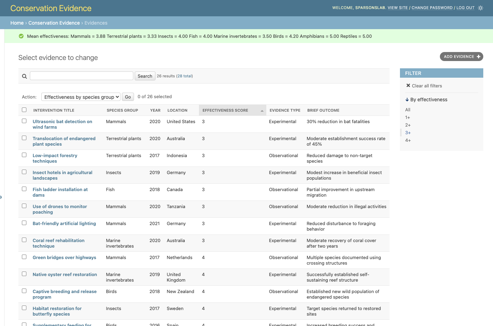

# RSE Conservation Evidence Task

The app is in the [evidence](evidence) folder.

### Importing data

A CSV of the example data is included([Task Sheet.csv](data/Task%20sheet.csv)). This can be 
imported into the database using the [import_from_csv.py](evidence/import_from_csv.py) script.
Either run the script as,

`python manage.py shell < evidence/import_from_csv.py`

or use the script's function `import_evidence_from_csv` in your own script.

### Effectiveness

The view of the `Evidences` table on the Admin page contains a filter for the effectiveness score (1+, 2+, etc.) and
an action to show the average effectiveness score by species group (shown as a message).

Relevant code is in [evidence/admin.py](evidence/admin.py).

### Deployment plan

I have included a Jupyter notebook ([web-app set-up.ipynb](notebooks/web-app%20set-up.ipynb)) that is
a **redacted** version what I used to deploy Arete's Django app on Azure. This goes step-by-step and covers
some details about configuration, security, etc.
